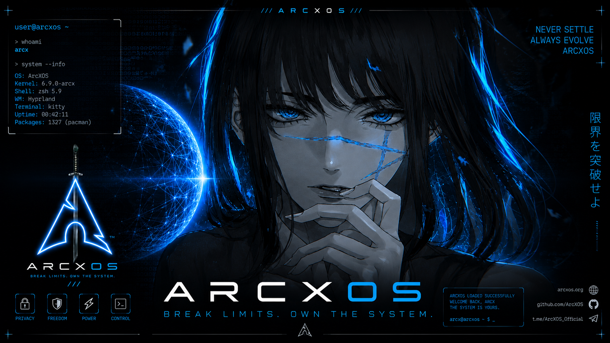
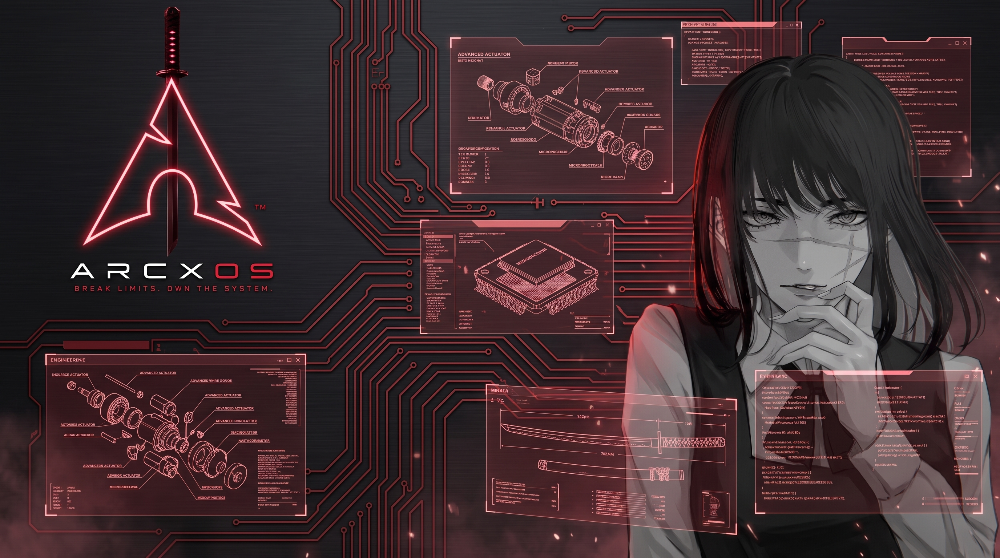
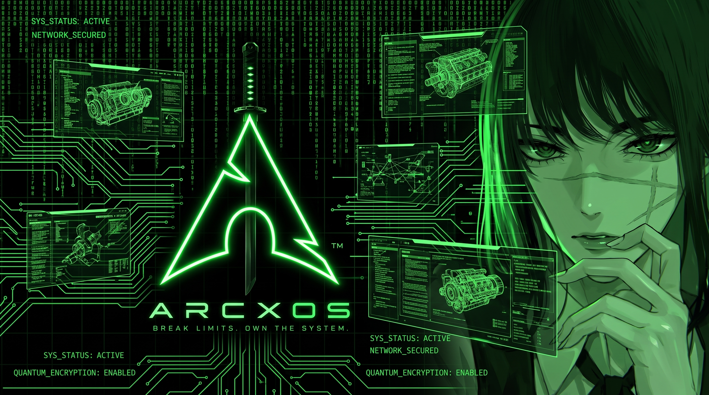
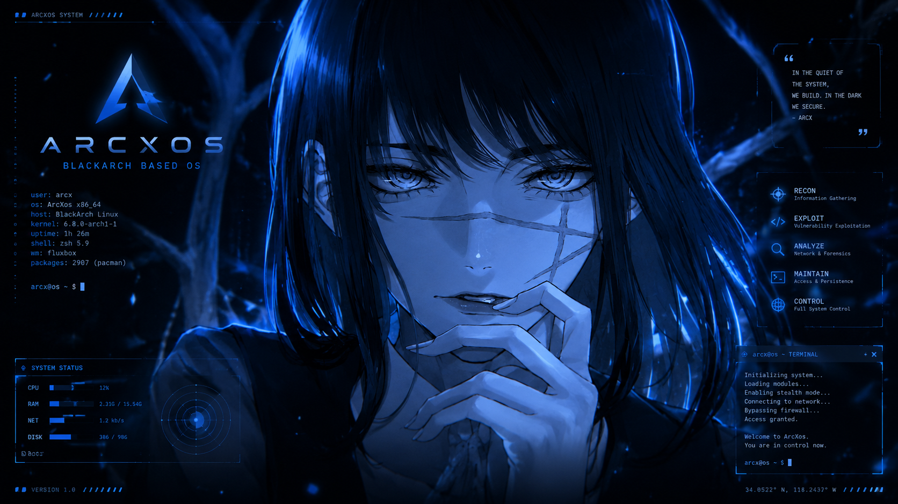
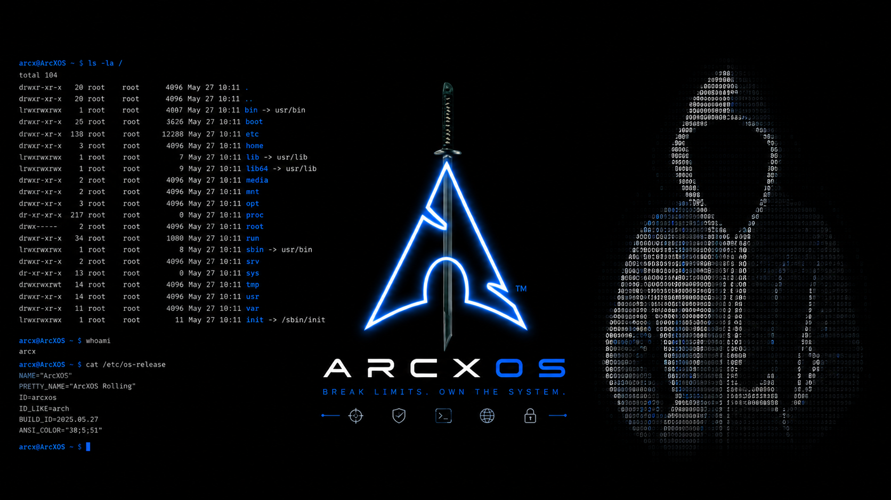

<p align="center">
  <br/>
  <h1 align="center">ArcXos Linux</h1>
</p>

<p align="center">
  
</p>

<p align="center">
  <a href="https://github.com/Arunachalam-gojosaturo/ArcXos"></a>
  <a href="https://archlinux.org"></a>
  <a href="https://blackarch.org"></a>
  <a href="#"></a>
  <a href="LICENSE"></a>
</p>

> [!IMPORTANT]
> **Project Clarification & Disclaimer**: **ArcXos Linux** is an independent, custom-built Arch Linux live distribution created by [Arunachalam](https://github.com/Arunachalam-gojosaturo). It is pre-configured with BlackArch security repository compatibility, custom desktop environments, and specialized security tools. **This repository is the official source repository for ArcXos ISO build profiles, not the upstream BlackArch Linux organization repository.**

---

## 📖 Deep-Dive Architecture & Core Philosophy

**ArcXos Linux** was engineered to solve a common problem faced by security researchers, ethical hackers, and penetration testers: **excessive resource consumption, UI lag on integrated graphics, and constant password prompt disruptions** during live security auditing sessions.

### 🧠 Core Architectural Pillars

1. **🚀 Ultra-Smooth Performance on Low VRAM**:
   - Custom Early KMS (Kernel Mode Setting) configuration for Intel (`i915`), AMD (`amdgpu`), and Nvidia GPUs.
   - Low-latency XFCE4 compositing and LightDM GTK greeter optimized to run without UI stutter on integrated GPUs (e.g. Intel UHD Graphics with 128 MB VRAM).

2. **🔑 Passwordless Administrative & GUI Workflow**:
   - **Passwordless Sudo**: The `wheel` group is configured in `/etc/sudoers.d/wheel` for passwordless privilege escalation (`NOPASSWD`).
   - **Global PolicyKit Rules**: Custom Polkit integration via [`49-nopasswd_global.rules`](file:///home/arunachalam/blackarch-iso/slim-iso/airootfs/etc/polkit-1/rules.d/49-nopasswd_global.rules) authorizes administrative GUI tools (GParted, Zenmap, Wireshark, Virt-Manager) without interrupting the user for passwords.
   - **Wireshark Integration**: The default live user is placed in the `wireshark` group with setuid `dumpcap` permissions for passwordless network packet captures directly from the GUI.

3. **🛠️ Integrated Multi-Edition Build System**:
   - Built on top of official Arch Linux `archiso` tools with clean modular profile definitions (`slim-iso`, `selective-iso`, `full-iso`, `netinstall-iso`).
   - Automated live environment chroot initialization via `customize_airootfs.sh` including locale generation, timezone linking, user management, and keyring setup.

---

## 🖼️ ArcXos Wallpaper & Aesthetic Showcase

ArcXos comes pre-loaded with an exclusive collection of high-resolution cyber security, hacker, and minimalist desktop wallpapers located under `airootfs/usr/share/backgrounds/`:

<table>
  <tr>
    <td width="50%">
      <p align="center"><b>ArcXos Cyber Blue Theme</b></p>
      
    </td>
    <td width="50%">
      <p align="center"><b>ArcXos Holographic Cyber Theme</b></p>
      
    </td>
  </tr>
  <tr>
    <td width="50%">
      <p align="center"><b>Green Hacker Theme</b></p>
      
    </td>
    <td width="50%">
      <p align="center"><b>Woman with ARCXOS Theme</b></p>
      
    </td>
  </tr>
  <tr>
    <td width="50%">
      <p align="center"><b>Hack The Planet</b></p>
      
    </td>
    <td width="50%">
      <p align="center"><b>YOR Cyber Art</b></p>
      
    </td>
  </tr>
  <tr>
    <td width="50%">
      <p align="center"><b>4K Minimalist Scenery</b></p>
      
    </td>
    <td width="50%">
      <p align="center"><b>Hoodie Hacker</b></p>
      
    </td>
  </tr>
</table>

### 🎨 Custom Wallpaper Switcher
ArcXos includes a custom wallpaper switching utility pre-configured in path:
```bash
arcxos-set-wallpaper
```

---

## ⚡ System Performance & Benchmark Comparison

ArcXos Slim was benchmarked against standard security ISO distributions on physical laptop hardware:

### 🖥️ Hardware Specifications Tested
- **Host**: Notebook CHUWI Innovation And Technology (ShenZhen) Co., Ltd.
- **Processor**: 12th Gen Intel(R) Core(TM) i3-1220P @ 4.40 GHz
- **GPU**: Intel UHD Graphics (128 MB Integrated VRAM utilizing `i915` driver)
- **RAM Footprint**: 1.77 GiB / 7.48 GiB (24% utilization)

### ⚖️ Performance Benchmark Comparison

| Performance Metric / Feature | Standard BlackArch ISO 🔴 | ArcXos Slim Edition 🟢 |
| :--- | :--- | :--- |
| **Integrated VRAM Performance** | UI stuttering and frame drops on 128 MB VRAM | **Lag-free, liquid smooth window rendering** |
| **Idle RAM Footprint** | ~2.5 GiB - 3.1 GiB idle memory | **~1.77 GiB idle memory footprint** |
| **GUI Admin Authentication** | Disruptive password prompts for GParted/Zenmap | **Passwordless Polkit & Sudo authorization** |
| **Hardware Driver Integration** | Standard kernel parameters | Early KMS enabled (`i915`, `amdgpu`, `nouveau`) |
| **Installers Included** | Basic CLI installer | **Custom GUI + CLI Installers (`arcxos-installer`)** |

---

## 📦 Distribution Profiles & Editions

ArcXos is organized into modular ISO build profiles tailored for different deployment needs:

### 1. ⚡ Slim Edition (`slim-iso`)
- **Use Case**: Fast live booting, lightweight pentesting, virtual machines, and portable USB drives.
- **Desktop**: XFCE4 + LightDM GTK Greeter.
- **Tool Suite**: Essential security tools, Ghidra, Cutter (`rz-cutter`), VS Code (`code`), Zenmap, Wireshark, OWASP ZAP, GParted.
- **Installers**: Includes `arcxos-gui-installer` and `arcxos-installer`.

### 2. 🎯 Selective Edition (`selective-iso`)
- **Use Case**: Specialized enterprise pentesting, monitoring, and custom security category deployments.
- **Enterprise Category Setup Scripts**:
  - `nessus-setup`: Deploys Tenable Nessus vulnerability scanner.
  - `openvas-setup`: Deploys Greenbone Vulnerability Management (OpenVAS).
  - `splunk-setup`: Deploys Splunk Enterprise & Log Analyzer.
  - `snort-setup`: Deploys Snort IDS/IPS engine.
  - `sentinelone-setup`: Deploys SentinelOne endpoint security agent.
  - `snyk-setup`: Deploys Snyk developer security scanner.
  - `cuckoo-setup`: Deploys Cuckoo Sandbox malware analysis environment.
  - `falcon-sensor-setup`: Deploys CrowdStrike Falcon Sensor.
  - `security-onion-setup`: Deploys Security Onion network monitoring.

### 3. 🛡️ Full Edition (`full-iso`)
- **Use Case**: Complete security repository installation installing thousands of security tools out-of-the-box.

### 4. 🌐 Netinstall Edition (`netinstall-iso`)
- **Use Case**: Minimal bootstrap network installation ISO.

---

## 📂 Repository Structure

```
ArcXos/
├── slim-iso/           # Slim ISO Edition Profile (XFCE4 + LightDM + GUI/CLI Installers)
│   ├── airootfs/       # Live target filesystem overlay
│   │   ├── etc/        # System configs (Polkit, LightDM, Sudoers, Grub, Pacman)
│   │   ├── root/       # customize_airootfs.sh chroot script & setup files
│   │   └── usr/        # Binaries (arcxos-installer, arcxos-gui-installer), desktop entries & wallpapers
│   ├── efiboot/        # UEFI systemd-boot bootloader configs
│   ├── syslinux/       # BIOS MBR isolinux bootloader configs
│   ├── packages.x86_64 # Curated package list for Slim edition
│   ├── pacman.conf     # Build Pacman configuration with BlackArch repository enabled
│   └── profiledef.sh   # Archiso profile definition and explicit permissions matrix
│
├── selective-iso/      # Selective ISO Edition Profile (Enterprise Category Deployments)
│   ├── airootfs/       # Includes category scripts (nessus-setup, openvas-setup, splunk-setup, etc.)
│   ├── efiboot/        # UEFI boot configuration
│   ├── syslinux/       # MBR boot configuration
│   ├── packages.x86_64 # Selective package list
│   └── profiledef.sh   # Selective profile metadata
│
├── full-iso/           # Full ISO Edition Profile
├── netinstall-iso/     # Network minimal installer profile
├── tools/              # ISO compilation scripts, menu generators, package list builders
├── misc/               # Minimal testing configs, disabled tool lists
├── build-selective-iso.sh # Automated build helper for Selective ISO profile
├── DOCUMENTATION.md    # Developer & architecture reference guide
└── README.md           # Distribution overview & build guide
```

---

## 🔑 Live Environment Credentials

Booting into any live ArcXos ISO provides the following pre-configured credentials:

- **Default Live User**: `liveuser` (Password: `arcx`)
- **Administrative Root Account**: `root` (Password: `arcx`)
- **Sudo Privilege**: `wheel` group with passwordless sudo access enabled (`NOPASSWD`).

---

## 🛠️ How to Build ArcXos ISOs

ArcXos ISOs are compiled using official Arch Linux `archiso` tools.

### 📋 Prerequisites

Build ArcXos on any Arch Linux or Arch-based distribution:

```bash
sudo pacman -S --needed archiso git
```

### 🔨 Compilation Steps

1. **Clone the Repository**:
   ```bash
   git clone https://github.com/Arunachalam-gojosaturo/ArcXos.git
   cd ArcXos
   ```

2. **Build Slim Edition**:
   ```bash
   cd slim-iso
   sudo mkarchiso -v -w /var/tmp/archiso-slim-work -o ../out .
   ```

3. **Build Selective Edition**:
   ```bash
   cd selective-iso
   sudo mkarchiso -v -w /var/tmp/archiso-selective-work -o ../out .
   ```
   *(Or run: `./build-selective-iso.sh`)*

4. **Build Full Edition**:
   ```bash
   cd full-iso
   sudo mkarchiso -v -w /var/tmp/archiso-full-work -o ../out .
   ```

> [!IMPORTANT]
> **Work Directory Storage Note**: Always specify `-w /var/tmp/archiso-work` to perform ISO creation on physical disk storage. Avoid building in default `/tmp/` because `/tmp` is mounted on `tmpfs` (RAM disk) and will cause out-of-memory errors during squashfs compression.

5. **Clean Build Artifacts**:
   ```bash
   sudo rm -rf /var/tmp/archiso-*-work
   ```

The compiled output ISO image will be placed inside the `out/` directory.

---

## 📖 Developer Documentation

For technical guidance on adding new packages, editing file permissions in `profiledef.sh`, modifying `customize_airootfs.sh`, or customizing LightDM themes, see [DOCUMENTATION.md](DOCUMENTATION.md).

---

## 🤝 Contributing

We welcome community contributions!
- **Bug Reports**: Open a GitHub issue with hardware specs and build logs.
- **Desktop Themes & Wallpapers**: Submit PRs with high-resolution custom artwork.
- **Installer Enhancements**: Submit improvements for `arcxos-installer` or `arcxos-gui-installer`.

---

## 📜 License & Credits

- **License**: Licensed under [GPL-3.0](LICENSE).
- **Upstream Credits**: Built on top of [Arch Linux](https://archlinux.org) and compatible with [BlackArch Linux](https://blackarch.org) packages.
