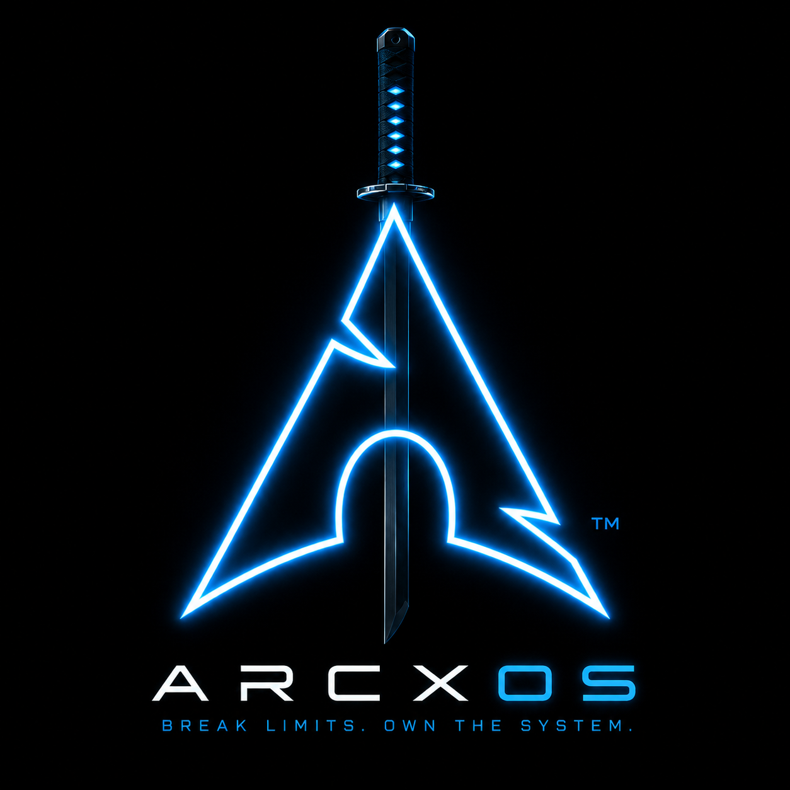
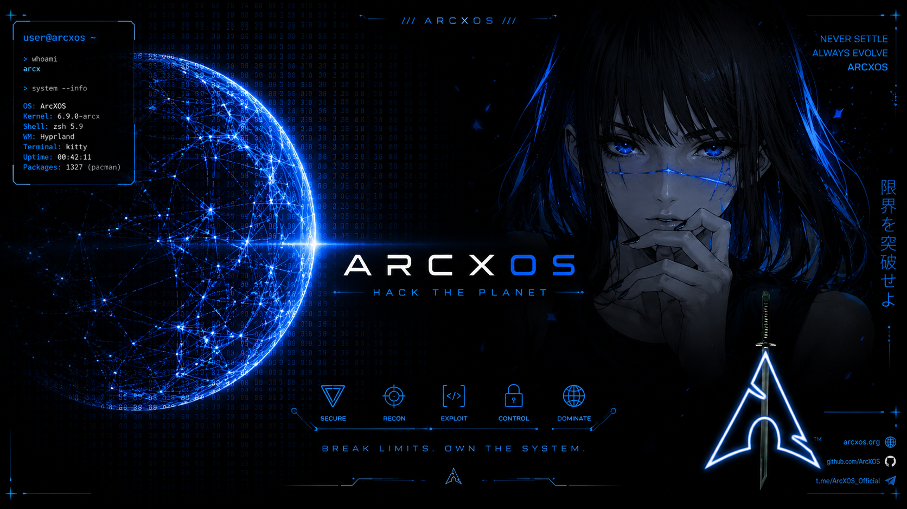
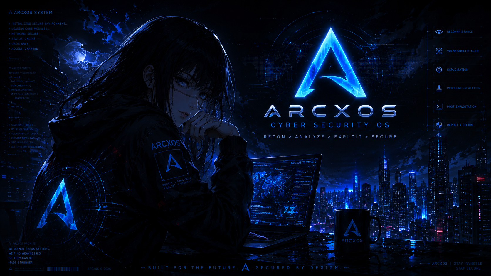

# <p align="center"><br>ArcXos Linux (Slim Edition)</p>

<p align="center">
  
  
  
  
</p>

🛡️ **ArcXos Slim Edition** is a highly customized, high-performance, and lightweight security auditing, ethical hacking, and penetration testing Linux distribution built on top of Arch Linux and BlackArch. 

Designed for both security professionals and enthusiasts, ArcXos Slim delivers a fast, stable, and sleek desktop experience with custom aesthetics, robust tool configurations, and a curated selection of essential penetration testing tools.

> [!IMPORTANT]
> **Live Boot Credentials:**
> - **Default Session User:** `liveuser` (Password: `arcx`)
> - **Root Administrative User:** `root` (Password: `arcx`)


---

## ✨ Features

- **🚀 Desktop Environment**: Lightweight XFCE4 desktop configured with customized shortcuts and dynamic settings.
- **🎨 Sleek Dark Aesthetics**: Custom themes, icon sets, and wallpapers with automated fallback configuration.
- **🛠️ Extended Security Suite**: Curated tools from BlackArch repos, plus VS Code (`code`), Zenmap (`zenmap`), Ghidra (`ghidra`), Cutter (`rz-cutter`), GParted (`gparted`), Wireshark GUI, and OWASP ZAP.
- **⚙️ Optimized Build Systems**: Configured with a modular Archiso profile for building custom ISOs easily.
- **⚡ High Performance**: Low resource usage, ideal for virtual machines, older hardware, and fast live boot sessions.
- **🔑 Passwordless Admin Access**: Built-in PolicyKit and Sudoers integration for running all GUI tools without password prompts.
- **🎮 Hybrid GPU & CPU Scaling**: Early KMS enabled for AMD, Intel, and Nvidia, backed by Mesa and Vulkan loaders with cpupower scaling.

---

## 🖼️ Artwork & Background Previews

Here are some of the custom wallpapers included in this distribution:

### Default Wallpaper
<p align="center">
  
</p>

### Custom Cyber Security & Cyberpunk Wallpapers
<table>
  <tr>
    <td width="50%">
      <p align="center"><b>Hack the Planet</b></p>
      
    </td>
    <td width="50%">
      <p align="center"><b>Yor War Devil Cyber</b></p>
      
    </td>
  </tr>
  <tr>
    <td width="50%">
      <p align="center"><b>Hoodie Hacker</b></p>
      
    </td>
    <td width="50%">
      <p align="center"><b>Cyberpunk Hacker Theme</b></p>
      
    </td>
  </tr>
</table>

---


## 📂 Repository Structure

This repository contains the build configuration (Archiso profile) for the ArcXos Slim ISO:

```
ArcXos/
├── airootfs/           # Files overlayed directly onto the live filesystem (/etc, /root, /usr, etc.)
├── efiboot/            # UEFI systemd-boot configurations
├── syslinux/           # MBR boot configurations
├── packages.x86_64     # Curated package list for the Slim edition
├── pacman.conf         # Pacman configuration for the build process
├── profiledef.sh       # Main build profile definition and permissions
├── DOCUMENTATION.md    # Detailed developer and configuration documentation
└── README.md           # Main overview (this file)
```

---

## 🛠️ How to Build ArcXos Slim ISO

ArcXos is built using the official `archiso` tools. Follow the guide below to build the ISO.

### 📋 Prerequisites

You must be running an Arch Linux system or a derivative. Install the build dependencies:

```bash
sudo pacman -S archiso git
```

### 🔨 Build Steps

1. **Clone the Repository**:
   ```bash
   git clone https://github.com/Arunachalam-gojosaturo/ArcXos.git
   cd ArcXos
   ```

2. **Compile the ISO**:
   Run the `mkarchiso` build tool with root permissions. Point the working directory (`-w`) to `/var/tmp/` (persistent physical disk) rather than `/tmp/` (which is often a limited `tmpfs` RAM disk and will run out of space):
   ```bash
   sudo mkarchiso -v -w /var/tmp/archiso-work -o ./out .
   ```

3. **Verify & Clean up**:
   Once completed, the build process will generate the ISO file in the `./out/` directory. You can clean up the temporary build environment files with:
   ```bash
   sudo rm -rf /var/tmp/archiso-work
   ```

---

## ⚙️ Key Customizations in ArcXos

### Live User Credentials
The live environment is configured with the following credentials:
- **Default User**: `liveuser` (Password: `arcx`)
- **Root User**: `root` (Password: `arcx`)

### 🔑 Passwordless Administrative & GUI Access
- **Passwordless Sudo**: The `wheel` group is configured for passwordless sudo privilege escalation (`NOPASSWD`).
- **Global PolicyKit Rules**: Polkit is configured via [49-nopasswd_global.rules](file:///home/arunachalam/blackarch-iso/slim-iso/airootfs/etc/polkit-1/rules.d/49-nopasswd_global.rules) to authorize GUI tools (like GParted, Virt-Manager, etc.) passwordlessly for administrative tasks.
- **Wireshark Integration**: The `liveuser` is placed in the `wireshark` group, and setuid is enabled on `dumpcap` so packet captures run passwordlessly directly from the GUI.

### Custom Scripts & Startup
- **[customize_airootfs.sh](file:///home/arunachalam/blackarch-iso/slim-iso/airootfs/root/customize_airootfs.sh)**: Sets up localization, timezone, user additions, fonts, default shell, BlackArch strap script configuration, and desktop environment settings.
- **[profiledef.sh](file:///home/arunachalam/blackarch-iso/slim-iso/profiledef.sh)**: Defines custom permissions for filesystem overlays, ISO labels, and supported boot modes (BIOS + UEFI).
- **Backgrounds**: Located under `airootfs/usr/share/backgrounds/` containing a collection of high-resolution cyber security and minimalist wallpapers.

---

## 📊 System Information & Performance Benchmarks

ArcXos Slim is highly optimized for resource-efficiency and stability. The system has been benchmarked on standard and low-resource hardware setups, proving its capability to deliver a lightweight but robust interface.

### 🖥️ Tested Hardware Specifications
- **Chassis**: Notebook CHUWI Innovation And Technology(ShenZhen)co.,Ltd
- **CPU**: 12th Gen Intel(R) Core(TM) i3-1220P @ 4.40 GHz
- **GPU**: Intel UHD Graphics (using the `i915` driver and 128 MB Integrated VRAM)
- **Memory**: 1.77 GiB / 7.48 GiB (24% utilization)

### ⚡ Performance & Stability Verdict
- **Lag-Free Experience**: The OS runs very smoothly with no lag even with integrated Intel UHD Graphics running on limited VRAM.
- **Robust Stability**: Demonstrates higher stability and smoother UI rendering compared to standard BlackArch ISOs on the same hardware.

### ⚖️ Comparison: Standard BlackArch ISO vs. ArcXos Slim

| Feature / Performance Metric | Standard BlackArch ISO 🔴 | ArcXos Slim Edition 🟢 |
| :--- | :--- | :--- |
| **VRAM / Intel UHD Performance** | Noticeable lag, UI stuttering, and heavy window frames on 128 MB integrated VRAM. | Runs **extremely smooth with no lag** on low/integrated VRAM setups. |
| **RAM Footprint** | High idle memory usage (often > 2.5 GiB idle). | Lightweight memory footprint (**~1.77 GiB** active after hours of uptime). |
| **GUI Tool Authorization** | Constant, disruptive password prompts for administrative tools (e.g. GParted, Zenmap). | **Passwordless admin GUI** access out-of-the-box (custom Polkit & Sudoers integration). |
| **Hardware Driver Integration** | Standard kernel drivers; lacks custom early KMS loading or modern Vulkan scaling. | Early KMS enabled for AMD/Intel/Nvidia + cpupower scaling configured. |
| **Tool Selection & Size** | Overwhelming list of duplicate/deprecated tools causing dependency bloat. | Curated selection of elite, essential tools (VS Code, Ghidra, Cutter, Wireshark, ZAP). |
| **System Stability** | Prone to UI freezes and lockups on low-spec notebooks or virtual machines. | **Highly stable and responsive** desktop execution across all tested conditions. |

### 🚀 Key Advantages of ArcXos Slim
- **Optimized for Low VRAM:** Designed to work flawlessly on thin-and-light notebooks (like CHUWI) without requiring dedicated graphics cards.
- **Out-of-the-box Convenience:** No password prompts when launching administrative apps from the GUI.
- **Cleaner Package Base:** Minimal bloat makes updates via Pacman much faster and less prone to broken packages.


### 📋 Benchmark / System Fetch
```text
 : "disabling hyprland logo is a war crime" - vaxry
┌──────────────────────────────────────────┐
   Chassis : Notebook CHUWI Innovation And Technology(ShenZhen)co.,Ltd 
   OS : Arch Linux
   Kernel : 7.1.3-arch1-2
   Packages : 868 (pacman)
   Display : 2160x1440 @ 60Hz [Built-in]
   Terminal : kitty 0.47.4
   WM : Hyprland
└──────────────────────────────────────────┘

   : arunachalam @ archlinux
┌──────────────────────────────────────────┐
   CPU : 12th Gen Intel(R) Core(TM) i3-1220P @ 4.40 GHz
   GPU : Intel UHD Graphics
   GPU Driver : i915
   Memory  : 1.77 GiB / 7.48 GiB (24%)
   OS Age  : 4 days
   Uptime  : 3 hours, 10 mins
└──────────────────────────────────────────┘
```

---

## 🤝 Contributing

We welcome contributions to package lists, aesthetic improvements, desktop themes, and documentation. Feel free to open an issue or submit a pull request!

## 📜 License

This project is licensed under the GPL-3.0 License - see the upstream Archiso/BlackArch licenses for more details.

